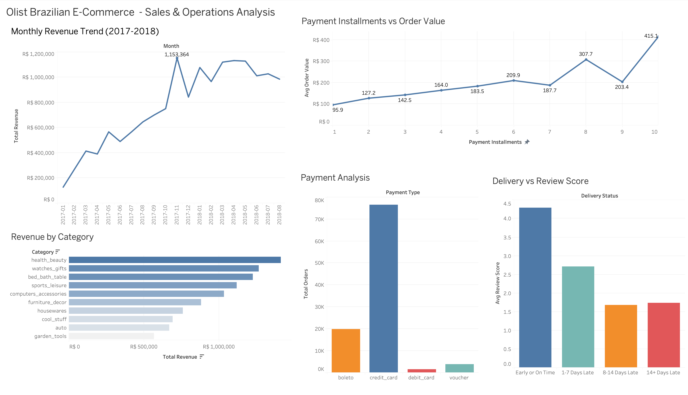
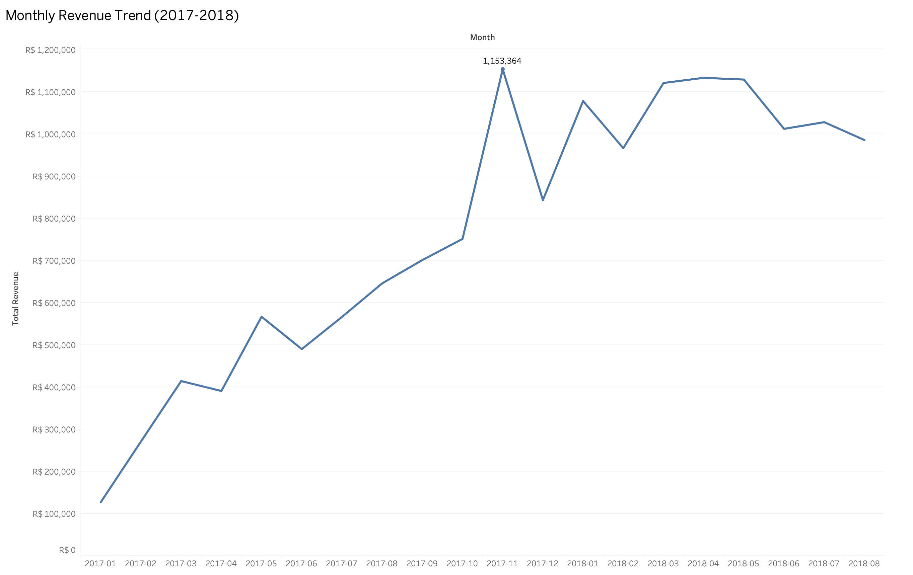
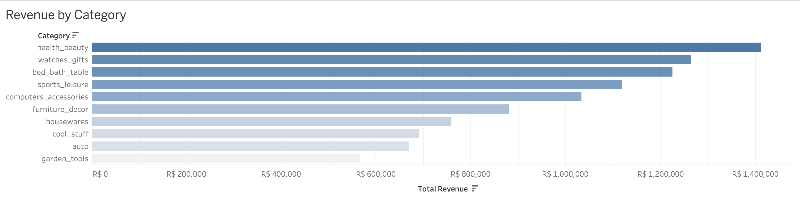
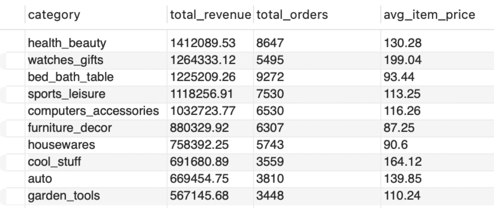
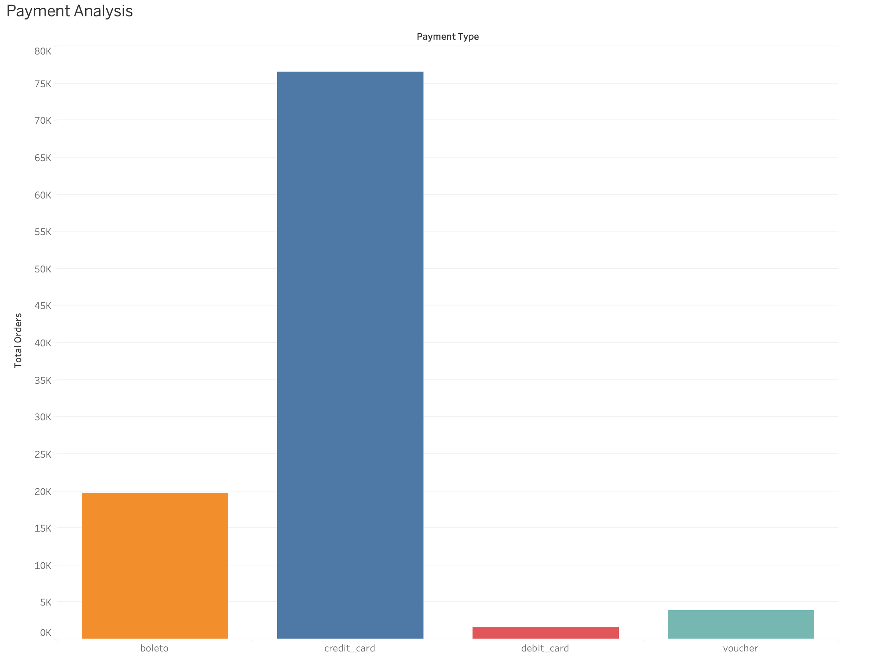
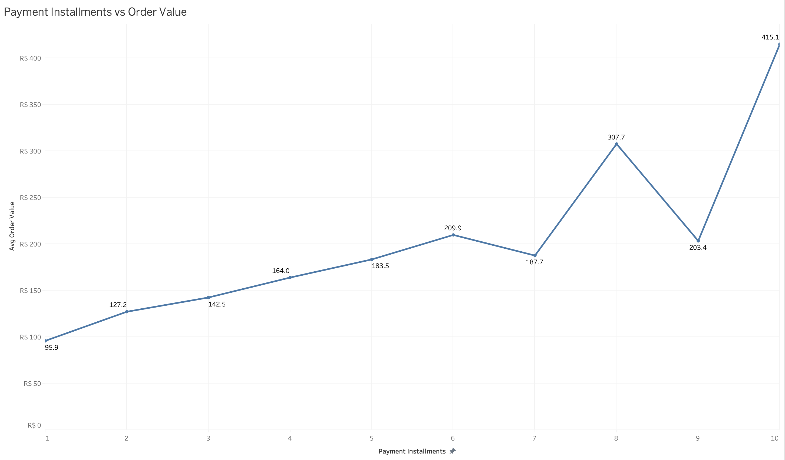
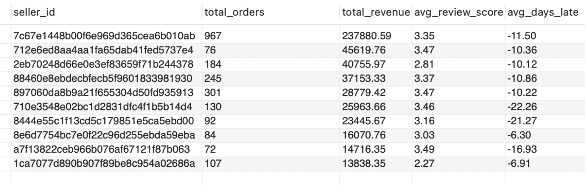
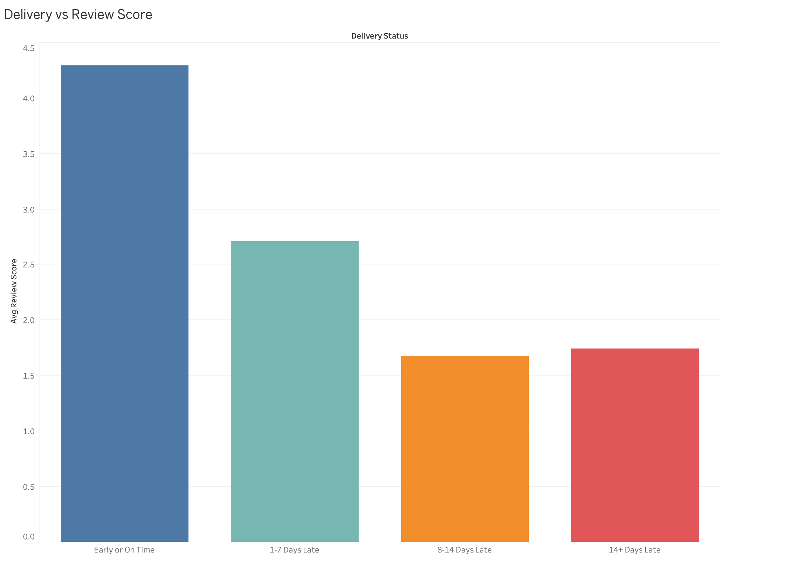
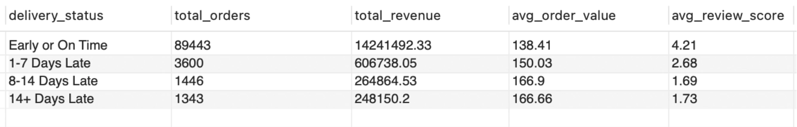

# Olist Brazilian E-Commerce — Sales & Operations Analysis

## Client Background

**Olist** is a Brazilian e-commerce marketplace that connects independent sellers to customers across Brazil. Similar to Amazon, Olist is a platform where sellers list products while Olist handles the storefront, payments, and logistics coordination.

This project analyses 96k+ real orders from the Olist platform using pure SQL to explore revenue trends, product performance, payment behaviour, delivery operations, and seller risk. The analysis was conducted to support Olist's operations and product teams in making data driven decisions.

The insights and recommendations focus on the following key areas:

- **Revenue Trends** — Monthly growth patterns and peak periods
- **Product Performance** — Revenue vs volume by category
- **Payment Behaviour** — Payment methods and installment impact on order value
- **Delivery Operations** — How delivery performance affects customer satisfaction
- **Seller Risk** — Identifying high revenue sellers with poor customer satisfaction

---

## Business Questions

1. How does revenue trend over time and when does the platform peak?
2. Which product categories drive the most revenue vs most orders?
3. How do payment methods and installment options affect order value?
4. Which sellers generate high revenue but pose a customer satisfaction risk?
5. At what point does late delivery cause customer satisfaction to collapse?
6. How much revenue is at risk from poor delivery performance?

---

## Executive Summary

Olist processed **96,000+ orders** between January 2017 and August 2018 generating over **R$15M** in total revenue . Revenue grew consistently throughout the period, peaking at **R$1,153,364 in November 2017** driven by Black Friday demand, before stabilising around R$1M per month through 2018.

Health & beauty is the top revenue generating category at R$1.4M, while watches & gifts generate the highest average item price at R$199. Credit card is the dominant payment method, and installment payments directly drive higher spending — customers paying in 10 installments spend **4.3x more** than single-payment customers.

Delivery performance has a dramatic impact on satisfaction — the average review scores drop from **4.29 to 2.71** the moment an order arrives late. R$1.1M in revenue — 7.3% of total platform revenue — was processed through late orders where customers gave an average review score below 2.7. Critically, poor seller reviews are not caused by late delivery, as problematic sellers are all delivering early on average, pointing to product quality or communication as the root cause.

---

## Database Structure

The analysis was conducted across 7 relational tables loaded into MySQL:

| Table | Description | Rows |
|---|---|---|
| olist_orders_dataset | Order status and timestamps | 99,441 |
| olist_order_items_dataset | Products, prices, freight per order | 112,650 |
| olist_order_payments_dataset | Payment method and installments | 103,886 |
| olist_order_reviews_dataset | Customer review scores | 99,224 |
| olist_products_dataset | Product details and categories | 32,951 |
| olist_sellers_dataset | Seller information | 3,095 |
| product_category_name_translation | Portuguese to English category names | 71 |

---

## Data Preparation

The cleaning process before the analysis:
- Removed 2,963 non-delivered orders (cancelled, unavailable, processing) 
- Resolved a UTF-8 encoding issue in the product category translation table caused by Portuguese special characters — fixed using Python and reloaded into MySQL
- Created a combined `products_with_category` table merging product IDs with English category names to optimise join performance of multiple tables
- Excluded 2016 data from trend analysis as the platform only launched in late 2016 and the partial year data is not representative

---

## Key Findings

### 1. Revenue grew consistently with a clear Black Friday peak

Revenue grew from **R$127K** in January 2017 to **R$751K** in October 2017, then a peak of **R$1.15M in November 2017** — a 53% jump driven by Black Friday demand. After the spike, revenue stabilised around R$1M per month through 2018, suggesting the business reached maturity. The consistent growth pattern indicates strong underlying demand.

---

### 2. Health & beauty leads revenue but bed bath & table leads volume

The top categories reveal an interesting relationship between volume and value. While health & beauty leads in both revenue and orders, watches & gifts stands out — ranking 2nd in revenue despite being 7th in order volume, driven by its high average item price of R$199. Bed bath & table takes the opposite position — the highest order volume but lower average prices at R$93.

Categories like watches & gifts operate on a premium, low-volume model — fewer orders but high item prices driving strong revenue. Categories like bed bath & table operate on a high-volume, low-margin model. Health & beauty sits in the middle, combining strong order volume with a healthy average price, making it the most balanced and highest revenue-generating category overall. 

---

### 3. Installment payments drive significantly higher order values

Credit card dominates at 74% of all transactions (76,505 orders, R$12.5M revenue). The installment analysis reveals a relationship between number of installments and order value:

| Installments | Avg Order Value |
|---|---|
| 1 | R$95.87 |
| 2 | R$127.23 |
| 5 | R$183.47 |
| 8 | R$307.74 |
| 10 | R$415.09 |

Customers paying in 10 installments spend **4.3x more** than single payment customers. This confirms that offering flexible payment options encourages higher value purchases.

---

### 4. High-revenue sellers with poor reviews are a platform risk

Poor review scores among top sellers are not caused by late delivery — all problematic sellers are delivering early on average. The root cause is likely product quality or seller communication:

The top revenue seller among poor performers generates R$237K — significant platform revenue tied to consistently poor customer satisfaction. These sellers are some of Olist's biggest earners and biggest reputational risks.

---

### 5. Just 1-7 days of late delivery results in a 37% drop in satisfaction

Review scores drop from 4.29 to 2.71 the moment an order is even slightly late which is a 37% decline. Beyond 7 days the damage plateaus around 1.7 regardless of how much later the order arrives. 

It is also worth noting that Olist systematically overestimates delivery times by an average of 10+ days. It is an intentional underpromise and overdeliver strategy that likely contributes to the high satisfaction scores.

---

### 6. R$1.1M in revenue is being processed through a broken customer experience

Late orders generated **R$1,119,752 in revenue** — 7.3% of total platform revenue — while delivering average review scores below 2.7. More concerning, late orders have higher average order values than timely orders:

Higher value purchases are more likely to arrive late and these are exactly the customers most likely to churn after a poor experience.

---

## Business Recommendations

Based on the findings above, the following actions are recommended for Olist's operations and product teams:

1. **Prioritise express logistics for high-value orders above R$150** — these orders are both most at risk of late delivery and represent the highest churn risk if the experience fails. A premium fulfilment tier for high value orders would protect the most valuable transactions on the platform.

2. **Enforce a 7-day maximum delay threshold** — satisfaction collapses the moment an order is late and the damage is fully done by day 7. Operational monitoring should flag any order approaching 7 days past its estimated delivery date for immediate intervention before the customer experience is permanently damaged.

3. **Expand installment payment options** — customers paying in installments spend more per order. Partnerships with fintech providers to offer installment options, particularly for high-value categories like watches and computers, could significantly increase average order value across the platform.

4. **Audit and flag sellers with review scores below 3.5** — since poor reviews are not caused by late delivery, the issue is product quality or seller communication. High-revenue sellers with low scores should be placed on improvement plans or removed if scores do not improve within a defined period.

5. **Invest in health & beauty and watches & gifts categories** — these are the two highest revenue categories with strong average item prices. Targeted seller recruitment and promotional campaigns in these categories represent a clear revenue growth opportunity on the platform.

---

## Tools & Technologies

- **MySQL** — database setup and all SQL analysis
- **Tableau Public** — interactive dashboard
- **Python** — CSV to MySQL data loading

---

## Files

- `queries.sql` — SQL queries used in this analysis
- [Live Tableau Dashboard](https://public.tableau.com/app/profile/dana.dobrosavljevic/viz/OlistBrazilianE-CommerceSalesandOperationsAnalysis/OlistBrazilianE-Commerce-SalesOperationsAnalysis)
- **Dataset:** [Olist Brazilian E-Commerce — Kaggle](https://www.kaggle.com/datasets/olistbr/brazilian-ecommerce)
